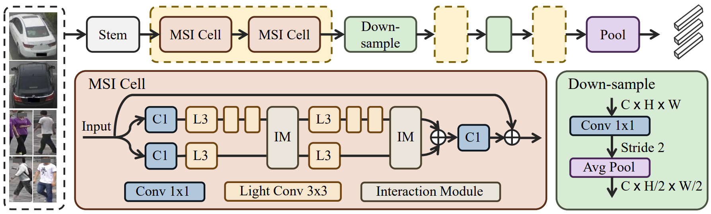

# MSINet
Official implementation of "[MSINet: Twins Contrastive Search of Multi-Scale Interaction for Object ReID](https://arxiv.org/abs/2303.07065)". 

## Abstract

Neural Architecture Search (NAS) has been increasingly appealing to the society of object Re-Identification (ReID), for that task-specific architectures significantly improve the retrieval performance. Previous works explore new optimizing targets and search spaces for NAS ReID, yet they neglect the difference of training schemes between image classification and ReID. In this work, we propose a novel Twins Contrastive Mechanism (TCM) to provide more appropriate supervision for ReID architecture search. TCM reduces the category overlaps between the training and validation data, and assists NAS in simulating real-world ReID training schemes. We then design a Multi-Scale Interaction (MSI) search space to search for rational interaction operations between multi-scale features. In addition, we introduce a Spatial Alignment Module (SAM) to further enhance the attention consistency confronted with images from different sources. Under the proposed NAS scheme, a specific architecture is automatically searched, named as MSINet. Extensive experiments demonstrate that our method surpasses state-of-the-art ReID methods on both in-domain and cross-domain scenarios.



## Datasets

Put the datasets into `./data`

* Market-1501
* MSMT17
* VeRi-776
* VehicleID

## Experiment Commands

### Evaluate the Performance of MSINet

**Train from Scratch**

```bash
python train.py
```

**Train after Pre-training**

Download the pre-trained model from [Google Drive](https://drive.google.com/file/d/1ZNLDbtpsraiF149htbyhbh3UjCwREi9p/view?usp=sharing) and put it into `./pretrained`. 

```bash
python train.py --pretrained
```

**Train Cross-domain Experiments**

```bash
python train.py -ds market1501 -dt msmt17 --pretrained --epochs 250
```

**Add SAM for Cross-domain Experiments**

```bash
python train.py -ds market1501 -dt msmt17 --pretrained --epochs 250 --sam-mode pos_neg
```

To train vehicle datasets, please add `--width 256`. 

### Conduct Search for Other Re-ID Datasets

```bash
python search.py -ds market1501
```

## Citation

```
@article{gu2023msinet,
  title={MSINet: Twins Contrastive Search of Multi-Scale Interaction for Object ReID},
  author={Gu, Jianyang and Wang, Kai and Luo, Hao and Chen, Chen and Jiang, Wei and Fang, Yuqiang and Zhang, Shanghang and You, Yang and Zhao, Jian},
  journal={arXiv preprint arXiv:2303.07065},
  year={2023}
}
```

